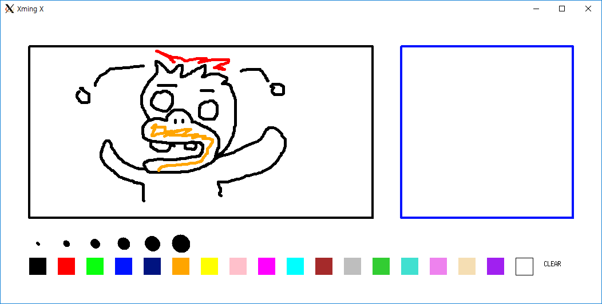

# pictionary-with-unix

## 개요
- 2016학년도 2학기 '고급프로그래밍' 수업 과제
- pthread 및 동기화 도구(Sychronization tool)와 IPC 기법(Inter Process Communication; 프로세스간통신)을 이용하여 프로세스가 UNIX 상에서 병행 동작하는 프로그램을 디자인
- SSH와 SCP를 통해서만 접속할 수 있는 UNIX(Solaris) 서버 환경에서 실행
- 캐치마인드(Pictionary) 구현

## 실행화면

